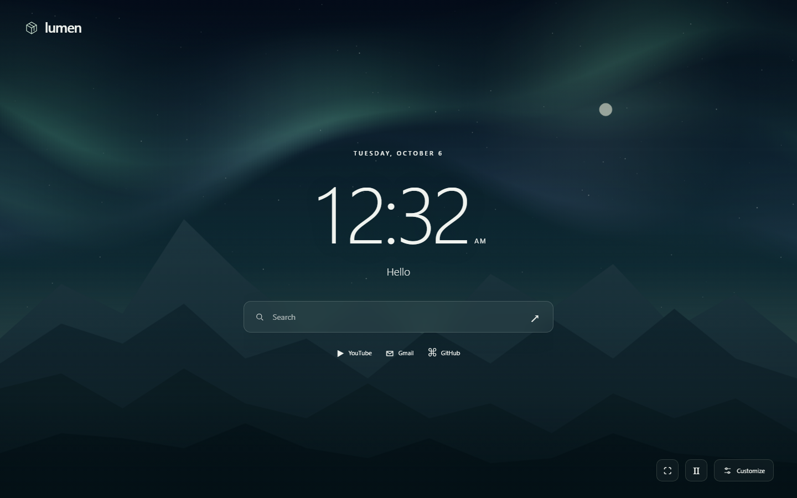
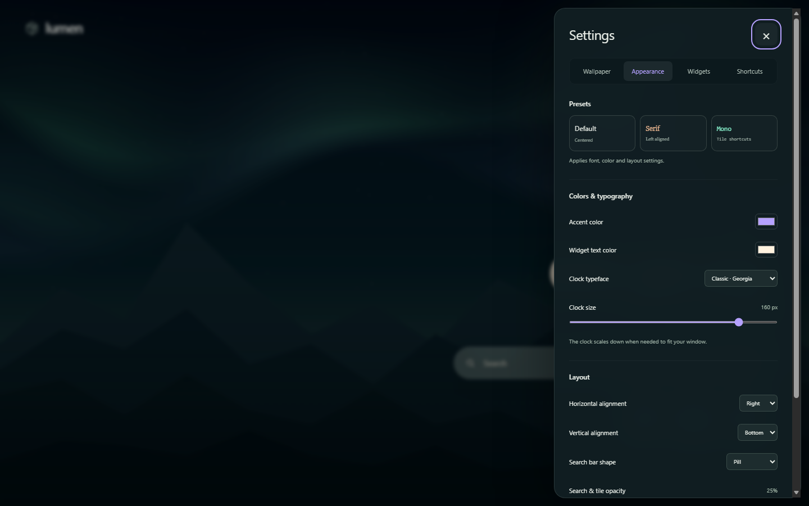
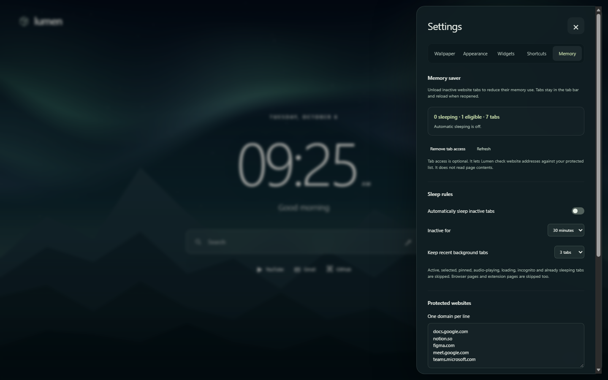

# Lumen

A new-tab extension for Chrome and Edge. Use a local video as your wallpaper, or pick one of three animated backgrounds.



## Install

1. Download or clone this repository.
2. Open `chrome://extensions` or `edge://extensions` and enable **Developer mode**.
3. Click **Load unpacked** and select the `extension` folder.
4. Open a new tab. Use **Customize** to choose a wallpaper and change your settings.

No build step is needed to install the extension. Keep its folder in place after loading it.

## Features

- MP4 and WebM wallpapers, plus JPG, PNG and WebP images.
- Brightness, blur, saturation, playback speed and crop positioning.
- Clock fonts, sizes, colors, alignment, seconds and time zones.
- Custom greetings and up to 12 editable shortcuts.
- Separate visibility controls for the clock, date, search, greeting and shortcuts.
- Wallpaper-only mode and automatic playback pause in background tabs.
- Optional memory saver to unload inactive website tabs across the browser.



Videos loop without audio. Files can be up to 150 MB, subject to available browser storage. Short videos load faster.

Get [free wallpapers](https://github.com/notgamermx/wallpaper): 25 original full-HD images across nature, space, abstract, anime-style scenery, and gaming-style designs, plus 5 live WebM wallpapers. Download a file, then open **Customize → Wallpaper** and choose it or drag it into the upload area.

Wallpaper files and settings stay in the browser profile. Lumen has no analytics, accounts or remote wallpaper requests. Search and shortcut links open the websites you choose. See [privacy details](docs/privacy.md).

## Memory saver

Open **Customize → Memory → Enable tab access**. The browser asks for the optional tab permission so Lumen can check website addresses against the protected list. Then turn on **Automatically sleep inactive tabs**, or use **Sleep eligible tabs** for a manual run. Automatic sleeping is off by default.

Choose a 5–120 minute inactivity timer, keep up to 10 recent background tabs awake, and exclude website domains. Active, selected, pinned, audio-playing, loading, private, already discarded, and explicitly non-discardable tabs are skipped. Browser and extension pages are also skipped. A domain exclusion includes its subdomains. Automatic checks run about once a minute and unload at most 10 tabs per run.

Tabs stay in the tab bar and reload when reopened. Save unfinished work, and protect sites used for editing, meetings, or silent video: Lumen cannot inspect page contents or reliably detect unsaved forms and every screen share or call. Some editing and meeting domains are protected by default. Removing tab access disables automatic sleeping.

This can reduce memory held by inactive pages; it does not control Chrome's total memory usage, free operating-system memory, or measure megabytes saved. The panel shows actual sleeping and eligible tab counts. Chrome also has a built-in Memory Saver under Settings → Performance, with additional browser-level safeguards. See [Chrome performance settings](https://support.google.com/chrome/answer/12929150) and [tab discarding](https://developer.chrome.com/docs/extensions/reference/api/tabs#method-discard).



## Updating

Replace the files in the same installed folder, click **Reload** on the Extensions page, and open a new tab. Removing the extension clears its saved data.

If you previously loaded the older `Wallpaper/lumen` folder, keep that installation for now. Loading this project's `extension` folder separately can give it a different extension ID and separate storage. To keep the old installation's wallpaper and settings, copy the contents of `extension` into the old installed folder and reload it.

## Development

Node.js 22 or newer is needed for development commands. The extension itself uses plain JavaScript and has no runtime dependencies.

```sh
npm ci
npm test
npm run check
npm run package
```

The ZIP is written to `dist/`. `npm run format` formats source files. GitHub Actions runs formatting, syntax and preference checks and builds the ZIP on pushes and pull requests.

Run the page checks with `npm run test:browser` and the tab-sleeping checks with `npm run test:memory-browser`. They use isolated headless Edge profiles on Windows. Set `BROWSER_PATH` to another compatible Chromium browser executable if needed. The memory test gives tab access to a temporary copy of the extension and ages fixture timestamps to test unloading without waiting for the inactivity timer. Production tab access stays optional. Browser checks are local; they are not included in CI. Generated screenshots, media fixtures and profiles go in the ignored `test-results` directory.

```text
extension/          Load this folder in the browser
  assets/           Icons
  scripts/          Page logic, preferences, storage and animation
  styles/           Page and settings styles
tests/              Preference and browser checks
scripts/            Source validation and ZIP packaging
docs/               Privacy information
.github/workflows/  CI configuration
```

## Limitations

Chrome/Edge 121 or newer is required. Chrome does not allow the new-tab override in incognito windows. Another new-tab extension may take priority. Video support depends on the browser's codecs; an unsupported file is rejected before it replaces the saved wallpaper. Firefox is not tested.
